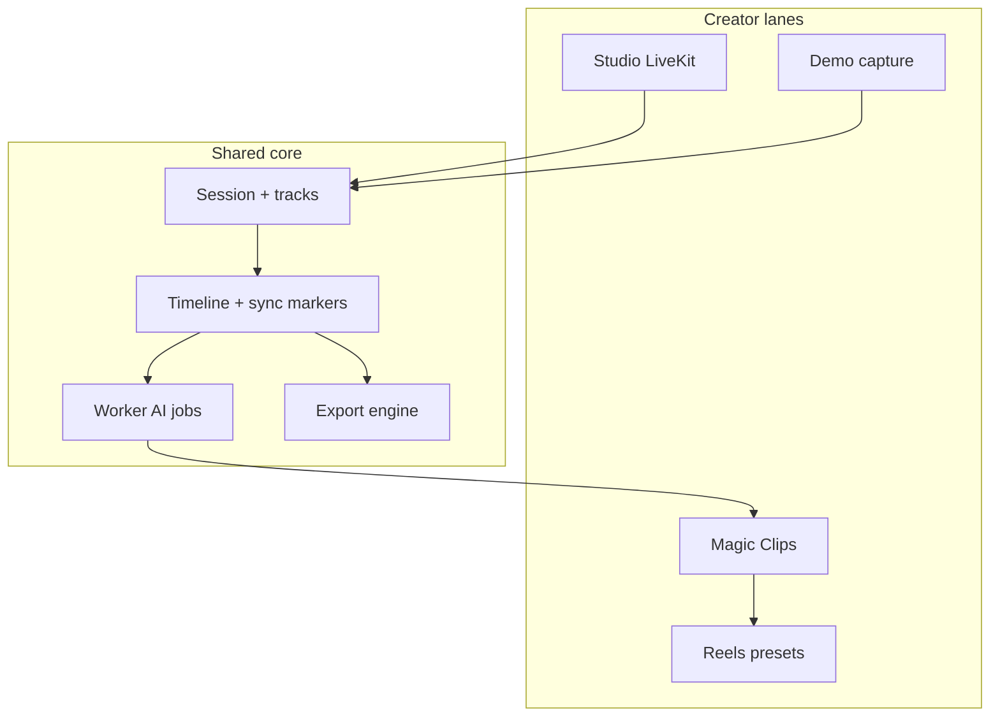

# Plan 19: Creator Suite Vision (Studio → Clips → Demo → Reels)

**Status:** in-progress (strategy locked; implementation gated)  
**Priority:** P0 (north star) / P2 per lane  
**Depends on:** Plan 13 Phase 0–1 (trust), Plan 18 (session data layer)

## Positioning (staged — grill locked)

**Now (public):** AI-native **recording producer** — Riverside-class trust, self-host option, local masters.  
**Roadmap (PRODUCT.md section):** **Creator Suite** for small creators, indie artists, product demo makers:

1. **Studio** — remote podcast/interview (LiveKit + local tracks) — **primary bet year 1**
2. **Clips** — magic vertical clips + captions (AI moat vs Riverside)
3. **Demo** — browser Screen Studio-lite (OpenScreen-inspired, not a clone)
4. **Reels** — timeline-lite + native JSON preset packs (CapCut-style rhythm, not import)

**Not competing with:** Adobe After Effects, full CapCut desktop, native Screen Studio macOS app.

**Competing with:** Riverside (trust), Descript-lite (text cuts), Loom/Screen Studio (demos), CapCut (templates) — **in lanes**, not all at once.

## Grill decisions (locked)

| Decision               | Choice                                                               |
| ---------------------- | -------------------------------------------------------------------- |
| Primary bet 6–12mo     | Trust studio (Plan 13 Phase 0–2)                                     |
| Demo platform v1       | Browser MVP (`getDisplayMedia` + cursor log + post-render)           |
| OSS + money            | MIT/Apache core + Ototabi Cloud SaaS tiers; self-host free           |
| Editor v1 (post-clips) | Timeline-lite (trim, text layers, one background style)              |
| AI moat                | Magic clips + 9:16 presets                                           |
| Riverside year-1 bar   | Recording trust only (no hosting/live stream)                        |
| Dashboard first        | Bugfixes + optional `dashboard.getSummary` + AI badges               |
| Demo start             | After Plan 13 Phase 0–1 (spec now, code later)                       |
| Export                 | Hybrid: browser quick edits; Railway worker FFmpeg for long/vertical |
| Reels/lyrics           | After magic clips; native JSON preset packs in repo                  |
| Positioning copy       | Staged in PRODUCT.md                                                 |

## Competitive matrix (research May 2026)

| Capability               | Riverside | Screen Studio / OpenScreen | CapCut        | Ototabi today  | Ototabi target     |
| ------------------------ | --------- | -------------------------- | ------------- | -------------- | ------------------ |
| Local multi-track remote | Core      | No                         | No            | Partial        | Phase 0–1          |
| Guest join / invites     | Core      | No                         | No            | Partial        | Phase 0            |
| Upload recovery          | Implied   | N/A                        | N/A           | Partial        | Plan 02 OPFS       |
| Transcript + filler      | Pro AI    | Local only                 | Auto captions | Partial worker | Harden 04          |
| Magic clips 9:16         | Pro       | No                         | Templates     | No             | Phase 3 moat       |
| Screen demo + auto-zoom  | No        | Core (desktop)             | No            | **None**       | Lane 3 browser     |
| Lyrics / reel templates  | No        | No                         | Core          | **None**       | Lane 4 after clips |
| Podcast hosting          | Built-in  | No                         | No            | No             | Defer              |
| Live multistream         | Live tier | No                         | No            | No             | Defer              |
| Self-host / OSS          | No        | OpenScreen MIT             | No            | **Yes**        | Differentiator     |

**OpenScreen** ([github.com/siddharthvaddem/openscreen](https://github.com/siddharthvaddem/openscreen)): Electron + PixiJS; screen/window/region; cursor highlight; manual/auto zoom; PiP webcam; timeline trim/speed; MP4/GIF. **Not production-grade per author.** Ototabi web lane takes **subset**: cursor event log + zoom regions + styled frame + export presets — Chrome/Edge first.

## Architecture: one platform, four lanes

**Session types (future schema):** `STUDIO` | `SOLO` | `DEMO` — same `RecordingSession`, different capture source (LiveKit vs `getDisplayMedia`).

## Lane 3 — Demo mode (spec only until Phase 0–1 done)

### Browser MVP capture

- `navigator.mediaDevices.getDisplayMedia({ video, audio })` + mic; optional cam PiP
- Parallel **cursor event stream** (JSON: `t, x, y, type, button`) at 30–60Hz throttled
- Chunks to OPFS/IndexedDB + upload (reuse Plan 02 dual-write)
- **Limits doc:** Safari system audio; Linux PipeWire; no native cursor hide on Linux (styled overlay instead)

### Browser MVP editor (post-capture)

- Timeline regions: **zoom** (manual v1, auto-suggest v2 from cursor clusters), **trim**, **speed**
- **Cursor overlay renderer** (Canvas/WebGL or FFmpeg `draw` filters): smoothing, click pulse, scale — inspired by Recordly/OpenScreen, implemented incrementally
- Backgrounds: solid / gradient / wallpaper presets (Retro Analog palette)
- Export: 16:9, 9:16, 1:1 via **hybrid export** (short → wasm; long → worker)

### Reference only (do not fork wholesale)

- OpenScreen: MIT, Electron — use as **UX reference**, not embedded dependency
- Recordly: cursor pipeline ideas — reimplement web-native

## Lane 2 — Magic clips (AI moat)

After transcript + `Clip` model (Plan 06):

- Worker: score segments (engagement, hook, silence-free); store `ClipCandidate` with rationale
- UI: dashboard + recordings badges; export **Clip pack** (3–5 verticals)
- One-click render: 9:16 + burned captions + hook text (editable)
- Feeds Lane 4 reel presets

## Lane 4 — Reels / lyrics (after clips)

- **Native JSON presets** in `packages/common/presets/` — versioned, no CapCut import
- Timeline-lite composer: placeholder slots (hook, b-roll beats, text lines) filled from clip/session
- Lyrics: optional LRC/upload + karaoke timing (v2); not v1

## Monetization (OSS + Cloud)

| Tier             | Audience    | Includes                                             |
| ---------------- | ----------- | ---------------------------------------------------- |
| **Self-host**    | Operators   | Full stack, bring your own keys                      |
| **Free cloud**   | Creators    | Limited hours/storage/AI minutes                     |
| **Pro cloud**    | Creators    | More AI minutes, priority export queue, no watermark |
| **Team** (later) | Small teams | Workspaces, shared rooms                             |

Gate: Whisper/LLM/export queue by plan (Plan 08) after features work.

## Rollout order (strict)

1. Plan 13 Phase 0 — upload auth, OPFS, recovery, private S3
2. Plan 13 Phase 1 — sync markers, timeline truth
3. Dashboard bundle + Plan 16 polish + deploy (Vercel + Railway)
4. Harden transcript → magic clips
5. Hybrid export worker on Railway
6. Timeline-lite editor + text cuts (Plan 05)
7. **Demo mode** implementation (browser MVP)
8. Reels preset packs
9. Live coach / hosting / marketplace — year 2+

## Superpowers execution (required for implementation)

Follow [`.plans/20-creator-suite-execution.md`](20-creator-suite-execution.md):

| Batch       | Plan file                                              |
| ----------- | ------------------------------------------------------ |
| 0 Trust     | [`20-batch-0-trust.md`](20-batch-0-trust.md)           |
| 1 Dashboard | [`20-batch-1-dashboard.md`](20-batch-1-dashboard.md)   |
| 2 Deploy    | [`20-batch-2-deploy.md`](20-batch-2-deploy.md)         |
| 3 AI clips  | `20-batch-3-ai-clips.md` (create at execute time)      |
| 4 Polish    | `20-batch-4-polish-export.md` (create at execute time) |

Skills chain: `using-git-worktrees` → `executing-plans` → `verification-before-completion` → `finishing-a-development-branch`.

## Future engineering plans

- `.plans/21-magic-clips-vertical.md` — detail when starting Batch 3
- `.plans/22-export-worker-ffmpeg.md` — hybrid export
- `.plans/23-preset-packs-reels.md` — after clips
- `.plans/24-demo-mode-browser.md` — when Phase 0–1 complete

## Acceptance (suite-level)

- Creator can complete: invite → record → recover upload → review transcript → export clip to 9:16 without leaving Ototabi
- Demo lane: record tab in Chrome → add 2 zooms → export MP4 9:16 (worker or wasm)
- No feature ships without visible status + recovery path (Plan 13 principles)
