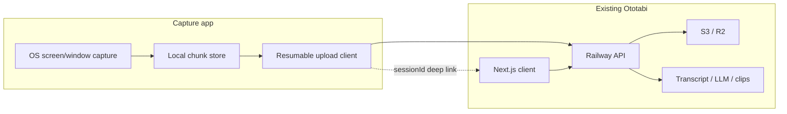

# Plan 29: Ototabi Capture — Desktop Companion

**Status:** spec (Wave 5 — no app code in this milestone)  
**Priority:** P2 (follows Demo browser v1.1 + parity v1 staging)  
**Horizon:** ~6–8 weeks after spec approval  
**Plan refs:** `.plans/28-engineering-consensus-may-2026.md` §5 Demo lane, `.plans/24-demo-mode-browser.md`

## Problem

Browser capture tops out around 40–50% of Screen Studio / OpenScreen parity: no global cursor, weak post-render zoom, FFmpeg.wasm limits, and fragile long-session uploads. A **thin desktop recorder** can use OS capture APIs while keeping **edit, AI, billing, and export in the existing web app**.

## Solution (two-track product)

| Track                        | Surface                                                                  | Scope                                                  |
| ---------------------------- | ------------------------------------------------------------------------ | ------------------------------------------------------ |
| **A — Web (shipped / v1.1)** | `/demo`, `/demo/record`, `/demo/[sessionId]/edit`, `/export/[sessionId]` | Cursor log, zoom regions, trim/speed, PiP, backgrounds |
| **B — Capture companion**    | Tauri **or** Electron shell                                              | Local record → upload → deep-link to web review/export |

**Rule:** Companion does **not** embed the full editor. After stop, open `https://<app>/recordings/{sessionId}` or `/export/{sessionId}`.

## Architecture

### Session modes

- **Preferred:** `RecordingSession.mode = DEMO` with `DemoSessionData` (cursor JSON, zoom, trim) — reuse `demo.startSession` / `demo.stopSession` / `demo.saveEdit`.
- **Stretch:** `STUDIO` thin capture (mic + screen only, no LiveKit) — new `capture.*` tRPC namespace if demo schema is too narrow; **default spec locks to demo API**.

### Upload contract

Reuse existing trust lane:

1. Create session via `demo.startSession` (host auth token from system browser OAuth or device code flow — TBD in implementation).
2. Chunked upload same as browser: presigned URLs / upload session from API (Plan 27 pool).
3. `demo.stopSession` when final chunk acked.
4. Poll `sessionReview.get` until transcript pipeline ready.

### Auth

| Option                 | Pros               | Cons            |
| ---------------------- | ------------------ | --------------- |
| System browser OAuth   | Reuses Better Auth | Extra hop       |
| Device code            | Headless-friendly  | New UX          |
| API token (long-lived) | Simple for MVP     | Security review |

**MVP recommendation:** open system browser to `FRONTEND_URL/auth/device` (new route) → paste token into app once.

## Tech choice: Tauri vs Electron

| Criterion        | Tauri 2                      | Electron                 |
| ---------------- | ---------------------------- | ------------------------ |
| Binary size      | Smaller                      | Larger                   |
| Screen capture   | Rust plugins / platform APIs | `desktopCapturer` mature |
| Team familiarity | Rust learning curve          | TS-only                  |
| Auto-update      | tauri-updater                | electron-updater         |

**Decision gate:** spike 2 days — record 1080p60 window + upload 5 min file on Linux + macOS. Pick whichever hits stable capture with fewer platform bugs.

## MVP feature list (companion v0)

1. Source picker: full screen / window / region (platform-dependent).
2. Optional mic + webcam PiP (same layout hints as demo export).
3. Local pause/resume; max duration guard (e.g. 90 min).
4. Upload progress + retry (resume chunks).
5. Tray menu: Start / Stop / Open last session in browser.
6. Settings: API base URL, account sign-in.

## Non-goals (v0)

- In-app timeline editor, AI regen, or FFmpeg export.
- LiveKit studio replacement.
- GIF export, styled click ripples.

## Files (future implementation)

| Area           | Path                                                 |
| -------------- | ---------------------------------------------------- |
| App shell      | `apps/capture/` (Tauri or Electron monorepo package) |
| Shared types   | `packages/common/src/capture/`                       |
| API extensions | `packages/trpc/src/modules/demo/` or `capture/`      |
| Docs           | `.docs/try-capture-smoke.md`                         |

## Acceptance criteria (MVP)

- [ ] 10 min screen recording uploads completely on staging.
- [ ] Web `/recordings/{id}` shows tracks + transcript pipeline within SLA of browser demo.
- [ ] No regression to studio `STUDIO` mode uploads.
- [ ] Signed builds for macOS (notarized) + Windows (Authenticode) documented.

## Open questions

- Device-code auth vs browser OAuth for v0.
- Whether cursor events are sampled in companion or only in web re-edit.
- Linux Wayland portal permissions UX.

## References

- `.plans/28-engineering-consensus-may-2026.md` — grill-locked two-track delivery
- `.docs/deploy-railway.md` — staging matrix for API + client URLs
- OpenScreen (UX reference only, not a dependency)
