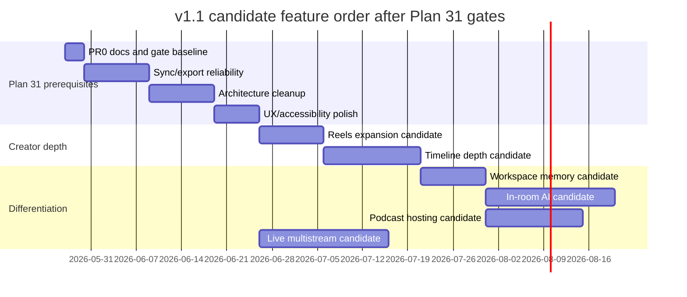

# Plan 30: v1.1 Execution Brief (post–parity v1)

**Status:** draft v1.1 scope proposal — not current execution source until reconciled with Plan 31  
**Created:** May 2026  
**Supersedes:** none operationally; proposes v1.1 scope changes for later reconciliation  
**Parent docs:** [28-engineering-consensus-may-2026.md](28-engineering-consensus-may-2026.md), [03-sync-markers-livekit-rtp.md](03-sync-markers-livekit-rtp.md), [19-creator-suite-vision.md](19-creator-suite-vision.md)

---

## 1. Purpose

Riverside parity **v1 code is on `main`**. This brief is a scope proposal, not the active execution order. The current production-hardening order lives in [Plan 31](31-production-hardening-master-plan.md), and hardening work should prioritize sync/export reliability plus architecture cleanup before building deferred v1.1 features.

This proposal defines:

1. What users can **try today** (operator path, no new features).
2. **Revised product scope** candidates (founder decision May 2026).
3. **Potential feature slices** with files, acceptance criteria, and tests.

It does **not** override [Plan 31](31-production-hardening-master-plan.md). Feature phases below are gated behind Plan 31's sync/export reliability work and architecture cleanup. Until those gates pass, this document is only a proposal backlog.

---

## 2. Proposed v1.1 scope candidates (gated by Plan 31)

The items below are proposed v1.1 candidates. They are not authorized as the current build order until Plan 31 completes the production-hardening prerequisites: doc/gate baseline, sync/export reliability, architecture cleanup, and production UX/accessibility polish.

| Feature                               | Parity v1 (Plan 28)         | **v1.1 (this plan)**                 |
| ------------------------------------- | --------------------------- | ------------------------------------ |
| RTP / sub-50ms multi-track sync       | Warnings only; RTP deferred | **P0 — complete before public beta** |
| Reels lane expansion                  | Freeze after batch 6        | **Build** — composer + more presets  |
| Timeline waveforms / undo / NLE depth | MVP only                    | **Build** — phased (see §6)          |
| Workspace memory                      | Cut                         | **Build**                            |
| In-room AI producer                   | Cut                         | **Build**                            |
| Live multistream                      | Cut                         | **Build**                            |
| Podcast hosting (RSS + episode pages) | Cut                         | **Build** (lite v1 — see §9)         |
| Ototabi Capture desktop               | Spec / later                | **Still OUT** — browser `/demo` only |
| YouTube OAuth direct publish          | Deferred                    | **Still OUT** — ZIP + manual upload  |
| Native mobile apps                    | Cut                         | **Still OUT**                        |

**GTM unchanged:** Ototabi Cloud primary; self-host secondary.

---

## 3. What to try _right now_ (Phase 0 — operator, ~0–2 days)

No feature code required. Success = one clean-machine run documented.

### Prerequisites

```bash
docker compose up -d
bun run db:migrate
bun dev   # client :3000, API :8080, worker
bun run check
```

### Smoke scripts (run in order)

| Doc                 | Path                                                                    | Proves                                                  |
| ------------------- | ----------------------------------------------------------------------- | ------------------------------------------------------- |
| Local full path     | [`.docs/try-local-smoke.md`](../.docs/try-local-smoke.md)               | Auth → studio → record → upload → AI → export → demo    |
| Studio trust        | [`.docs/try-studio-trust-smoke.md`](../.docs/try-studio-trust-smoke.md) | Preflight, consent, health, co-host, mute/remove        |
| Billing             | [`.docs/try-billing-smoke.md`](../.docs/try-billing-smoke.md)           | Trial caps, upgrade CTAs (with `DODO_PAYMENTS_API_KEY`) |
| Demo                | [`.docs/try-demo-smoke.md`](../.docs/try-demo-smoke.md)                 | Screen capture v1.1                                     |
| Recovery (optional) | [`.docs/try-recovery-smoke.md`](../.docs/try-recovery-smoke.md)         | Tab-kill upload resume                                  |

### Staging deploy

Follow [`.docs/deploy-railway.md`](../.docs/deploy-railway.md) §4 — Vercel client, Railway API + worker + Postgres + Redis + MinIO, `BETTER_AUTH_URL` = public client origin.

### Phase 0 exit criteria

- [ ] `git push origin main` (or release branch)
- [ ] Staging migrate + smoke pass
- [ ] Dodo products + webhook configured
- [ ] One **Pro** dogfood: record (2 participants) → upload → transcript → clips → 9:16 + reels preset → export bundle
- [ ] Defects logged as GitHub issues tagged `v1.1`

---

## 4. Plan 31 prerequisite: RTP / sync (P0, ~1–2 weeks)

This work belongs to Plan 31's sync/export reliability track. It remains in this proposal as context because v1.1 feature candidates depend on it, but it is not an independent Plan 30 feature lane.

### 4.1 Problem (explain to stakeholders)

Each participant records **locally** with their own clock. Merging without alignment causes lip-sync drift (often 100–500 ms). **Sync markers** every 2s are already stored; **RTP timestamps** from LiveKit tie those pulses to a **shared media clock** so export can align tracks to **&lt;50 ms** without slow waveform matching.

### 4.2 Current state on `main`

| Piece                          | Status                                                                                                         |
| ------------------------------ | -------------------------------------------------------------------------------------------------------------- |
| `SyncMarker` table + migration | Done — `localTime`, optional `rtpTimestamp`, `trackSid`                                                        |
| Studio broadcasts every 2s     | Done — `localTime` only ([`chat/[roomId]/page.tsx`](<../apps/client/app/(site)/chat/[roomId]/page.tsx>))       |
| `syncMarkers.submit` tRPC      | Done — accepts `rtpTimestamp`, `trackSid`                                                                      |
| Session review timeline        | Done — markers as `SYNC_MARKER` events                                                                         |
| Export warnings                | Done — [`getSyncAlignmentWarnings`](../apps/client/lib/merge-session-timeline.ts)                              |
| Export alignment math          | **Incomplete** — single `getSyncMarkerOffsetMs` (first marker globally), `adelay` on merge — **not per-track** |

### 4.3 Target behavior

1. Every 2s while recording, each client submits: `{ localTime, rtpTimestamp, trackSid, sessionId }`.
2. **Reference track** = host’s primary audio track (or earliest `trackSid` with markers).
3. For each other track, compute **offsetMs** = f(markers) by interpolating RTP↔local pairs (linear regression or piecewise linear between pulses).
4. **Browser merge** and **worker session export** apply **per-track** `adelay` / `atrim` / `setpts` as needed.
5. If RTP missing for a participant, fall back to `localTime`-only interpolation; downgrade confidence → existing warnings.
6. Acceptance: synthetic test fixtures ±50 ms; manual 2-person session sounds aligned on clap/stop.

### 4.4 Implementation slices

| PR     | Scope                              | Files (primary)                                                                                                         |
| ------ | ---------------------------------- | ----------------------------------------------------------------------------------------------------------------------- |
| **1A** | Capture RTP + trackSid in studio   | `apps/client/app/(site)/chat/[roomId]/page.tsx`, new `apps/client/lib/studio/sync-marker-publisher.ts`                  |
| **1B** | Pure alignment module + unit tests | `packages/common/src/sync-alignment.ts` (or `apps/client/lib/studio/sync-alignment.ts`), `*.test.ts`                    |
| **1C** | Wire export page per-track offsets | `apps/client/app/(site)/export/[sessionId]/page.tsx`, deprecate naive `getSyncMarkerOffsetMs` for multi-track           |
| **1D** | Worker export uses same offsets    | `apps/worker/src/processors/export-render.ts`, shared import from `@ototabi/common`                                     |
| **1E** | Docs + smoke                       | Update [03](03-sync-markers-livekit-rtp.md), [try-local-smoke.md](../.docs/try-local-smoke.md) §2 (2 guests, clap test) |

### 4.5 Technical spikes (agent must verify)

- [ ] LiveKit JS: how to read RTP timestamp for **local** published mic track at marker time (participant track stats / `RTCRtpReceiver` / LiveKit `LocalTrack` APIs — use Context7 / LiveKit docs).
- [ ] Demo mode: markers during `getDisplayMedia` sessions — same publisher or studio-only v1?
- [ ] Reference track selection when host has no audio (video-only).

### 4.6 Acceptance criteria

- Markers include `rtpTimestamp` on ≥95% of pulses in a 5+ min 2-participant session (Chrome + Edge).
- Unit tests: 3+ markers per track, known RTP drift → computed offset within **50 ms** of golden.
- Export UI shows per-track offset summary (monospace debug row or advanced panel).
- Warnings still show when marker count &lt; 3 or tracks uncovered.
- `bun run check` passes.

### 4.7 Non-goals (Phase 1)

- Waveform cross-correlation fallback
- Sample-accurate DAW sync
- Rewriting recorder chunk timing

---

## 5. Candidate feature: Reels lane expansion (~1–2 weeks after Plan 31 gates)

### 5.1 Current state

- 9:16 clip render + **reels presets** (`bold-captions`, `minimal-lower-third`) — [20-batch-6-reels.md](20-batch-6-reels.md)
- Worker: `reelsPresetId` on export job; `ClipReelsPresetPicker` UI

### 5.2 Target (v1.1)

| Item                | Description                                                                             |
| ------------------- | --------------------------------------------------------------------------------------- |
| Preset packs        | +2–4 JSON presets in `packages/common` (hooks, lower-third variants)                    |
| Reels composer lane | On export or clip review: ordered slots (hook → body → CTA) filled from clip candidates |
| Batch export        | “Export all reels variants” for top N clips                                             |
| Optional            | Safe-zone overlay preview (9:16 grid)                                                   |

### 5.3 Slices

| PR  | Scope                                               |
| --- | --------------------------------------------------- |
| 2A  | New preset JSON + worker drawtext tests             |
| 2B  | `ReelsComposer` UI component (no CapCut import)     |
| 2C  | tRPC `clips.queueReelsBatch` + plan gate (Creator+) |

### 5.4 Acceptance

- User picks 3 clips → one action queues preset renders → downloads ZIP or individual URLs.
- `bun run check`; smoke: [try-local-smoke.md](../.docs/try-local-smoke.md) §4 reels step.

---

## 6. Candidate feature: Timeline depth (~2–3 weeks after Plan 31 gates)

### 6.1 Current state (MVP shipped)

- `timeline-lite.tsx`, `timeline-math.ts`, `use-export-timeline.ts`, scrub + trim handles on `/export/[sessionId]`

### 6.2 Phased delivery (do not big-bang Plan 07)

| Sub-phase | Features                                                     | Priority                      |
| --------- | ------------------------------------------------------------ | ----------------------------- |
| **3A**    | Waveforms per lane (`decodeAudioData` + canvas), load &lt;3s | P1                            |
| **3B**    | Undo/redo stack (trim + cut marks), Ctrl+Z                   | P1                            |
| **3C**    | Multi-cam “active lane” at playhead → export layout          | P2                            |
| **3D**    | Ripple trim, split clip                                      | P3 (full NLE — defer if slip) |

### 6.3 Files

- Create: `WaveformCanvas.tsx`, `timeline-history.ts` (undo stack)
- Extend: `recording-timeline-shell.tsx`, export page

### 6.4 Acceptance

- 2-track session: waveforms visible; trim undo restores previous in/out.
- Export output reflects trim + active lane.

---

## 7. Candidate feature: Workspace memory (~2 weeks after Plan 31 gates)

### 7.1 Definition

Persistent **per-workspace** (or per-room) context used by AI and UI defaults — **not** raw media storage.

Examples: show name tone, recurring guest names, standard intro/outro copy, sponsor read defaults, preferred export preset.

### 7.2 Data model (proposal)

```prisma
model WorkspaceProfile {
  id          String   @id @default(cuid())
  roomId      String   @unique  // v1: 1:1 with Room; later Team workspace
  brandVoice  String?  // markdown or JSON
  showFormat  Json?    // { introSec, outroSec, adSlots }
  metadata    Json?
  updatedAt   DateTime @updatedAt
}
```

### 7.3 Slices

| PR  | Scope                                                                                         |
| --- | --------------------------------------------------------------------------------------------- |
| 4A  | Schema + `workspace` module (router → service → repository)                                   |
| 4B  | Settings UI on `/rooms/{id}/settings`                                                         |
| 4C  | Inject profile into LLM prompts (show notes, chapters) — **no** cross-workspace media leakage |

### 7.4 Policy / safety

- Only room **hosts/co-hosts** edit profile.
- LLM context: text fields only; never auto-attach other sessions’ transcripts.
- Audit log optional (v2).

### 7.5 Acceptance

- Host sets brand voice → regenerate show notes reflects tone.
- Guest in another room cannot read profile.

---

## 8. Candidate feature: In-room AI producer (~3–4 weeks after Plan 31 gates)

### 8.1 Definition

Real-time assistance **during** LiveKit session — side panel or data-channel messages — **not** replacing post-session Whisper/LLM.

### 8.2 v1.1 scope (minimal viable)

| In scope                                                                          | Out of scope                           |
| --------------------------------------------------------------------------------- | -------------------------------------- |
| Side panel “Producer” tab on studio                                               | Full LiveKit AI bot participant        |
| Events: silence &gt;8s, guest disconnected, clipping hint (level meter)           | Auto-editing timeline during record    |
| Host-triggered: “suggest question”, “bookmark moment” → `RecordingEvent` + marker | Playing music/stingers                 |
| Uses host **Pro+** plan gate                                                      | Workspace-wide learning during session |

### 8.3 Architecture

```
Studio UI → trpc.aiProducer.* (rate limited)
         → Redis pub/sub or LiveKit data channel ← optional push hints
Post-session → existing transcript/clips pipeline (unchanged)
```

### 8.4 Slices

| PR  | Scope                                                     |
| --- | --------------------------------------------------------- |
| 5A  | `RecordingEvent` types `AI_BOOKMARK`, `AI_HINT` + UI list |
| 5B  | Heuristic hints (silence/disconnect) client-side first    |
| 5C  | Optional LLM “suggest question” (host click, Pro+)        |

### 8.5 Acceptance

- Host sees ≥1 actionable hint in a 10 min 2-person test.
- Bookmarks appear on session review timeline.
- No extra Whisper cost until post-session pipeline runs.

---

## 9. Candidate feature: Podcast hosting lite (~2–3 weeks after Plan 31 gates)

### 9.1 Definition

**Not** full Riverside hosting. **Lite v1:**

- Public **RSS feed** per show (room or user)
- Episode pages with embedded **signed** audio player (auth or tokenized link)
- Manual “publish episode” from a completed `RecordingSession` (merged MP3 + metadata)

### 9.2 Out of scope v1.1

- Spotify/Apple direct submit APIs
- Dynamic ad insertion
- Download analytics dashboard (basic hit count OK)

### 9.3 Slices

| PR  | Scope                                                     |
| --- | --------------------------------------------------------- |
| 6A  | `PodcastShow` + `PodcastEpisode` schema, publish mutation |
| 6B  | RSS XML route `GET /feeds/:showId.xml`                    |
| 6C  | Public episode page `/p/:slug` with signed audio          |

### 9.4 Acceptance

- Publish session → RSS validates in podcast validator tool.
- Unpublished sessions not in feed.

---

## 10. Candidate feature: Live multistream (~3–4 weeks after Plan 31 gates)

### 10.1 Definition

While recording (or parallel egress), send composite or program feed to **RTMP destinations** (YouTube Live, Twitch, custom).

### 10.2 Recommended approach

- **LiveKit Egress** (room composite or participant) → RTMP URL(s) configured in room settings.
- UI: host adds stream keys (encrypted at rest), toggle “Go live” with consent + indicator.

### 10.3 Dependencies

- Stable studio + RTP sync (Phase 1) — viewers see acceptable live sync even if local masters are better.
- Legal: stream consent copy in addition to record consent.

### 10.4 Slices

| PR  | Scope                                      |
| --- | ------------------------------------------ |
| 7A  | `RoomStreamDestination` schema + CRUD      |
| 7B  | API start/stop egress (LiveKit server SDK) |
| 7C  | Studio UI + REC/LIVE indicators            |

### 10.5 Acceptance

- Staging: RTMP to test container (e.g. nginx-rtmp) receives stream for 60s.
- Failure: destination down → host sees error, local record continues.

---

## 11. Candidate timeline (not execution order)

This is a feature sequencing sketch for after Plan 31. It is not the production-hardening master timeline. The active order remains:

1. Plan 31 PR0 docs/gate baseline.
2. Plan 31 sync/export reliability.
3. Plan 31 architecture cleanup.
4. Plan 31 production UX/accessibility polish.
5. Reconcile this proposal and schedule only the approved feature candidates.



**Parallelism note:** Candidate hosting can overlap candidate in-room AI after workspace schema patterns exist. Candidate multistream can start only after Plan 31 sync/export reliability and UX/accessibility polish are accepted; full UI should follow studio trust smoke.

| Order | Work                            | Status in this document                          |
| ----- | ------------------------------- | ------------------------------------------------ |
| 0     | Plan 31 docs/gate baseline      | Active production-hardening prerequisite         |
| 1     | Plan 31 sync/export reliability | Active production-hardening prerequisite         |
| 2     | Plan 31 architecture cleanup    | Active production-hardening prerequisite         |
| 3     | Plan 31 UX/accessibility polish | Active production-hardening prerequisite         |
| 4     | Reels                           | Candidate feature after hardening gates          |
| 5     | Timeline depth                  | Candidate feature after hardening gates          |
| 6     | Workspace memory                | Candidate feature after hardening gates          |
| 7     | In-room AI                      | Candidate feature after workspace patterns       |
| 8     | Podcast hosting                 | Candidate feature after quality path is proven   |
| 9     | Live multistream                | Candidate feature after sync/export and UX gates |

**Explicitly not scheduled:** Ototabi Capture desktop ([29-ototabi-capture-companion.md](29-ototabi-capture-companion.md)).

---

## 12. Cross-cutting rules (all phases)

- `bun fmt`, `bun run db:format:check`, `bun lint`, `bun typecheck`, `bun run test` before done.
- Module-first: `packages/trpc/src/modules/<domain>/`.
- No raw Prisma in tRPC responses.
- Plan gates when `DODO_PAYMENTS_API_KEY` set.
- Update smoke docs per phase.
- Prefer shared logic in `packages/common` when client + worker both need it (e.g. sync alignment).

---

## 13. Agent handoff prompt (copy-paste)

Use this to start a planning or execution session:

```
Read .plans/31-production-hardening-master-plan.md first, then .plans/30-v1.1-execution-brief.md and .plans/28-engineering-consensus-may-2026.md.

Context: Riverside parity v1 is merged to main. Plan 31 is the active execution order. This Plan 30 document is a v1.1 feature proposal only; deferred features must wait behind sync/export reliability and architecture cleanup.

Your job:
1. Confirm Phase 0 operator checklist — list blockers from repo state (migrations, env vars).
2. Produce a PR-by-PR execution plan for the next Plan 31 slice only.
3. Do NOT implement Plan 30 feature candidates until Plan 31 sync/export reliability and architecture cleanup are accepted.

Constraints: bun run check must pass; module-first trpc; no podcast OAuth; no desktop Capture app.
```

---

## 14. Open questions (founder / product — decide before Phase 5+)

| #   | Question                                             | Default if no answer          |
| --- | ---------------------------------------------------- | ----------------------------- |
| 1   | Workspace = per `Room` or future `Team` entity?      | Per `Room`                    |
| 2   | Podcast hosting public without auth on RSS?          | Public RSS; signed media URLs |
| 3   | Multistream on Trial plan?                           | No — Pro+ only                |
| 4   | In-room AI: client heuristics only vs always-on LLM? | Heuristics v1; LLM on button  |
| 5   | Demo sessions: RTP markers too?                      | Studio only in Phase 1        |

---

## 15. References

- RTP plan: [03-sync-markers-livekit-rtp.md](03-sync-markers-livekit-rtp.md)
- Timeline vision: [07-multi-track-timeline-editor.md](07-multi-track-timeline-editor.md)
- Distribution: [09-distribution-youtube-bundles.md](09-distribution-youtube-bundles.md)
- Competitive roadmap: [13-riverside-competitive-roadmap.md](13-riverside-competitive-roadmap.md)
- Handoff status: [`.docs/subagent-handoff.md`](../.docs/subagent-handoff.md)
